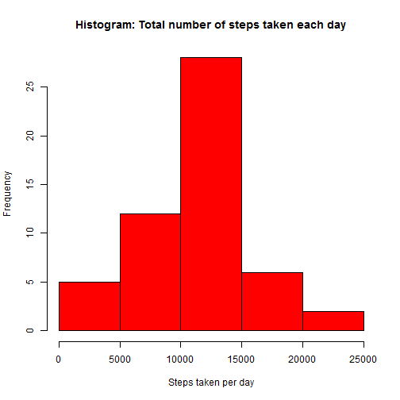
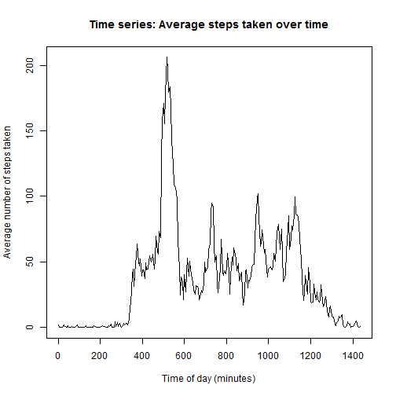
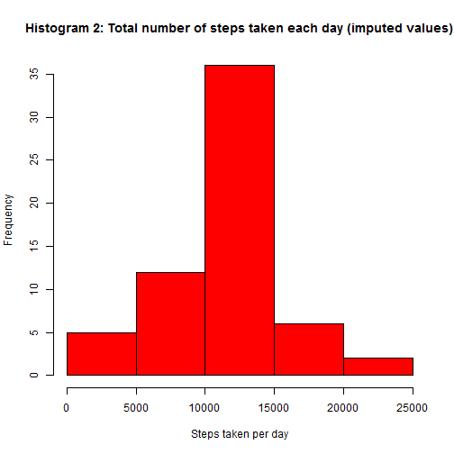
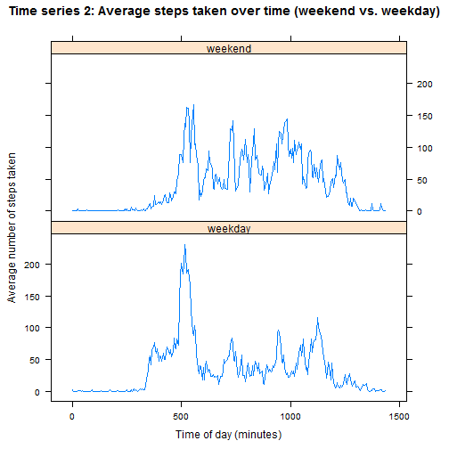

# Reproducible Reasearch: Peer Assessment 1  
All code and explanatory text provided below:  


## Loading and preprocessing the data
The following code reads in the activity data (saved in the current working directory), converts the date variable to be of class date, and creates a new interval variable that is the actual time of day in minutes (ex. 1435 minutes = 11:55 pm) so the time intervals are evenly spaced for plotting and easier to work with for the analysis.

```r
setwd("C:/Users/Dunny/Github_repos/RepData_PeerAssessment1/activity")
ACT_DATA <- read.table("activity.csv", sep = ",", header = TRUE)
ACT_DATA$date <- as.Date(ACT_DATA$date)
ACT_DATA$NEW_INT <- rep(0:287)*5
```


## What is mean total number of steps taken per day?
The below code calculates the total number of steps taken per day (removing all missing values) and produces a histogram of the total number of steps taken each day:


```r
options(scipen = 1, digits = 2)

library(dplyr)
```

```
## 
## Attaching package: 'dplyr'
## 
## The following objects are masked from 'package:stats':
## 
##     filter, lag
## 
## The following objects are masked from 'package:base':
## 
##     intersect, setdiff, setequal, union
```

```r
FILTER<-ACT_DATA[!is.na(ACT_DATA$steps), ]
DAYS <- group_by(FILTER, date)
SUMM_STEP<- summarize(DAYS, TOT_STEP = sum(steps, na.rm = TRUE))

hist(SUMM_STEP$TOT_STEP, xlab = "Steps taken per day", col = "red", main = "Histogram: Total number of steps taken each day")
```

 

```r
mean <- mean(SUMM_STEP$TOT_STEP, na.rm = TRUE)
median <- median(SUMM_STEP$TOT_STEP, na.rm =TRUE)
```
The mean number of steps taken per day is 10766.19 and the median number of steps taken per day is 10765 (excluding missing values). 

## What is the average daily activity pattern?
The below code calculates the average number of steps taken for each 5-minute time interval, averaged across all days and produces a time series plot with these results. 


```r
INT <- group_by(ACT_DATA, NEW_INT, interval)
INT_AVE<- summarize(INT, AVE_STEP = mean(steps, na.rm = TRUE))
plot(INT_AVE$NEW_INT, INT_AVE$AVE_STEP, type = "l", xlab = "Time of day (minutes)", ylab = "Average number of steps taken")
title("Time series: Average steps taken over time")
```

 

```r
MAX_STEP_INT<-INT_AVE[INT_AVE$AVE_STEP==max(INT_AVE$AVE_STEP), 2]
MAX_STEP_MIN <-INT_AVE[INT_AVE$AVE_STEP==max(INT_AVE$AVE_STEP), 1]
MAX_STEP_VAL <-INT_AVE[INT_AVE$AVE_STEP==max(INT_AVE$AVE_STEP), 3]
```
On average across all the days in the dataset, the 5-minute interval of time with the maximum number of steps (206.17 steps) started at the 515 minute of the day (or the time 835 am).

## Imputing missing values
The code below calculates the number of missing values in the dataset and then imputes all missing values using the time interval averages across all days. A histogram is then created of the total number of steps taken each day using the imputed data.


```r
TOT_NA <- sum(!complete.cases(ACT_DATA))

MERGE = merge(INT_AVE,ACT_DATA, by = "interval", all = TRUE)
MERGE$IMP_STEPS<- ifelse(is.na(MERGE$steps) == FALSE, MERGE$steps, MERGE$AVE_STEP)

DAYS2 <- group_by(MERGE, date)
SUMM_STEP_IMP<- summarize(DAYS2, TOT_STEP = sum(IMP_STEPS, na.rm = TRUE))

hist(SUMM_STEP_IMP$TOT_STEP, xlab = "Steps taken per day", col = "red",  main = "Histogram 2: Total number of steps taken each day (imputed values)")
```

 

```r
mean2 <- mean(SUMM_STEP_IMP$TOT_STEP, na.rm = TRUE)
median2 <- median(SUMM_STEP_IMP$TOT_STEP, na.rm = TRUE)
```
There were 2304 records with missing values in the dataset that were imputed.

With the missing values imputed, the mean number of steps taken per day is 10766.19 and the median number of steps taken per day is 10766.19. These values are very similar to the mean and median of the data when simply excluding missing values, suggesting that in this scenario, missing data had little effect on the overall distribution of the data. 


## Are there differences in activity patterns between weekdays and weekends?
The below code creates a new factor variable indicating whether a giving value was recorded on a weekday or weekend. A panel plot containing a time series plot is then created displaying the average number of steps taken for each 5-minute time interval, averaged across all weekday days (bottom) or weekend days (top).


```r
MERGE$WKEND<- factor((weekdays(MERGE$date) %in% c("Saturday", "Sunday")), levels = c(FALSE, TRUE), labels = c('weekday', 'weekend'))

INT_WK <- group_by(MERGE, interval, NEW_INT.x, WKEND)
INT_AVE_WK<- summarize(INT_WK, AVE_STEP = mean(IMP_STEPS, na.rm = TRUE))

library(lattice)
xyplot(AVE_STEP~NEW_INT.x|WKEND, data = INT_AVE_WK, type = "l", layout = c(1,2), xlab = "Time of day (minutes)", ylab = "Average number of steps taken", main = "Time series 2: Average steps taken over time (weekend vs. weekday)")
```

 
